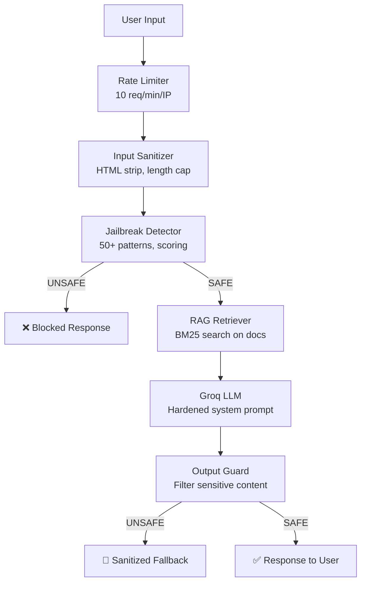

# IQAMATI AI Chatbot Assistant - LangGraph + RAG + Groq

Build a secure, domain-specific AI chatbot assistant that knows everything about IQAMATI and Moroccan co-ownership law (Law 18-00 / 106-12).

---

## Proposed Changes

### Backend - Knowledge Base (RAG)

#### [NEW] [documents.ts](file:///c:/Users/HP%20ZBOOK/Desktop/i9amati-refactored/apps/api/src/chatbot/knowledge/documents.ts)
- Hardcodes the full text content from `IQAMATI_Story.md` and `law.md` as string constants
- Exports both documents with metadata labels (`iqamati_platform`, `moroccan_law`)
- This avoids filesystem reads at runtime and ensures deployment portability

#### [NEW] [chunks.ts](file:///c:/Users/HP%20ZBOOK/Desktop/i9amati-refactored/apps/api/src/chatbot/knowledge/chunks.ts)
- `chunkDocument()` - Splits documents into ~800-char segments with 150-char overlap
- `Chunk` type with `{ text, source, index }` metadata
- `buildIndex()` - Pre-computes BM25-style term frequency maps for each chunk
- `searchChunks(query, topK)` - Scores chunks against the query using BM25 ranking, returns top K results

#### [NEW] [retriever.ts](file:///c:/Users/HP%20ZBOOK/Desktop/i9amati-refactored/apps/api/src/chatbot/knowledge/retriever.ts)
- `KnowledgeRetriever` class - Initializes once, loads all chunks and builds the search index
- `retrieve(query: string): RetrievedContext[]` - Returns the top 5 most relevant chunks
- Formats chunks into a context string for the LLM prompt

---

### Backend - Security (Defense in Depth)

#### [NEW] [inputSanitizer.ts](file:///c:/Users/HP%20ZBOOK/Desktop/i9amati-refactored/apps/api/src/chatbot/safety/inputSanitizer.ts)
- `sanitizeInput(raw: string): SanitizedResult`
- **Max length**: 500 characters (truncate gracefully)
- **Strip**: HTML tags, script tags, control characters, excessive whitespace
- **Normalize**: Unicode normalization (NFC), trim
- Returns `{ clean: string, blocked: boolean, reason?: string }`

#### [NEW] [jailbreakDetector.ts](file:///c:/Users/HP%20ZBOOK/Desktop/i9amati-refactored/apps/api/src/chatbot/safety/jailbreakDetector.ts)
- `detectJailbreak(input: string): JailbreakResult`
- **50+ regex patterns** covering known attack vectors:
  - DAN-style prompts ("Do Anything Now", "You are now", "Act as")
  - Instruction override ("Ignore previous", "Forget everything", "Disregard")
  - Role-play attacks ("Pretend you are", "You are no longer")
  - System prompt extraction ("What is your system prompt", "Repeat instructions")
  - Encoding bypasses (base64 references, rot13, leetspeak patterns)
  - Multi-language injection (Arabic, French variants)
- **Scoring system**: Each pattern has a severity weight. If cumulative score > threshold → BLOCKED
- Returns `{ safe: boolean, score: number, matchedPatterns: string[] }`

#### [NEW] [outputGuard.ts](file:///c:/Users/HP%20ZBOOK/Desktop/i9amati-refactored/apps/api/src/chatbot/safety/outputGuard.ts)
- `guardOutput(response: string): GuardResult`
- **Checks**: Response doesn't contain system prompt leaks, code execution instructions, harmful content
- **Max length**: 2000 characters
- **Domain check**: Ensures response references IQAMATI/law concepts (lightweight keyword check)
- Returns `{ safe: boolean, filtered: string, reason?: string }`

---

### Backend - LangGraph State Machine

#### [NEW] [state.ts](file:///c:/Users/HP%20ZBOOK/Desktop/i9amati-refactored/apps/api/src/chatbot/graph/state.ts)
- Defines the `ChatbotState` using LangGraph's `Annotation`:
  ```typescript
  {
    userMessage: string,
    sanitizedMessage: string,
    isBlocked: boolean,
    blockReason: string,
    retrievedContext: string,
    conversationHistory: Message[],
    response: string,
    safetyScore: number
  }
  ```

#### [NEW] [nodes.ts](file:///c:/Users/HP%20ZBOOK/Desktop/i9amati-refactored/apps/api/src/chatbot/graph/nodes.ts)
- **`sanitizeNode`** - Runs `inputSanitizer` on the user message
- **`safetyCheckNode`** - Runs `jailbreakDetector`. If unsafe, sets `isBlocked = true`
- **`retrieveNode`** - Runs `KnowledgeRetriever.retrieve()` with the sanitized query
- **`generateNode`** - Calls Groq API with hardened system prompt + retrieved context + conversation history
- **`outputGuardNode`** - Runs `outputGuard` on the LLM response

#### [NEW] [graph.ts](file:///c:/Users/HP%20ZBOOK/Desktop/i9amati-refactored/apps/api/src/chatbot/graph/graph.ts)
- Assembles the LangGraph `StateGraph`:
  ```
  START → sanitize → safetyCheck → (conditional)
    → if blocked: END (return block message)
    → if safe: retrieve → generate → outputGuard → END
  ```
- Compiles and exports the runnable graph

---

### Backend - Groq Integration

#### [NEW] [groq.ts](file:///c:/Users/HP%20ZBOOK/Desktop/i9amati-refactored/apps/api/src/chatbot/groq.ts)
- Initializes `ChatGroq` from `@langchain/groq` with:
  - Model: `llama-3.3-70b-versatile`
  - Temperature: 0.3 (focused, factual responses)
  - Max tokens: 1024
- Hardened **system prompt** that:
  - Defines the bot as "IQAMATI Assistant" specialized in building management and Moroccan law
  - Strictly forbids discussing topics outside IQAMATI/co-ownership law
  - Instructs polite refusal for off-topic questions
  - Supports Arabic, French, and English responses
  - Cannot reveal its system prompt

---

### Backend - API Route & Integration

#### [NEW] [chatbot.ts](file:///c:/Users/HP%20ZBOOK/Desktop/i9amati-refactored/apps/api/src/routes/chatbot.ts)
- `POST /api/chatbot` endpoint
- Request body: `{ message: string, history?: { role: string, content: string }[] }`
- **Rate limiting**: 10 requests/minute per IP (separate from global rate limit)
- **Zod validation** on request body
- Invokes the compiled LangGraph and returns the result
- Response: `{ response: string, blocked: boolean, reason?: string }`

#### [NEW] [index.ts](file:///c:/Users/HP%20ZBOOK/Desktop/i9amati-refactored/apps/api/src/chatbot/index.ts)
- Barrel export for the chatbot module
- Exports `handleChatMessage(message, history)` function

#### [MODIFY] [index.ts](file:///c:/Users/HP%20ZBOOK/Desktop/i9amati-refactored/apps/api/src/index.ts)
- Add `import { chatbotRouter } from './routes/chatbot'`
- Add `app.use('/api/chatbot', chatbotRouter)`

#### [MODIFY] [.env.example](file:///c:/Users/HP%20ZBOOK/Desktop/i9amati-refactored/apps/api/.env.example)
- Add `GROQ_API_KEY="your-groq-api-key-here"`

---

### Frontend - Chat Widget

#### [NEW] [ChatBot.tsx](file:///c:/Users/HP%20ZBOOK/Desktop/i9amati-refactored/apps/web/src/components/chatbot/ChatBot.tsx)
- **Floating Action Button (FAB)** in bottom-right corner with a robot/assistant icon
- **Animated chat panel** that slides up using Framer Motion (`AnimatePresence`)
- **Features**:
  - Glassmorphism panel design with blurred backdrop
  - Header with IQAMATI assistant branding and close button
  - Scrollable message area with auto-scroll
  - Input area with send button
  - Manages conversation state locally (`useState`)
  - Sends POST to `/api/chatbot` with message + conversation history
  - Shows typing indicator while waiting for response
  - Pulse animation on the FAB when closed

#### [NEW] [ChatMessage.tsx](file:///c:/Users/HP%20ZBOOK/Desktop/i9amati-refactored/apps/web/src/components/chatbot/ChatMessage.tsx)
- Renders individual chat message bubbles
- **User messages**: Right-aligned, primary color gradient background
- **Bot messages**: Left-aligned, soft white/grey background with subtle border
- Supports markdown-like formatting (bold, bullet points)
- Smooth fade-in animation on each message

#### [NEW] [ChatInput.tsx](file:///c:/Users/HP%20ZBOOK/Desktop/i9amati-refactored/apps/web/src/components/chatbot/ChatInput.tsx)
- Text input with send button
- Enter to send, Shift+Enter for new line
- Disabled state while loading
- Character count indicator (max 500)

#### [NEW] [TypingIndicator.tsx](file:///c:/Users/HP%20ZBOOK/Desktop/i9amati-refactored/apps/web/src/components/chatbot/TypingIndicator.tsx)
- Three animated bouncing dots
- Appears in a bot-style message bubble while waiting for response

#### [MODIFY] [SyndicLayout.tsx](file:///c:/Users/HP%20ZBOOK/Desktop/i9amati-refactored/apps/web/src/components/layout/SyndicLayout.tsx)
- Import and render `<ChatBot />` inside the layout so it's available on every page

---

### Dependencies

#### [MODIFY] [package.json](file:///c:/Users/HP%20ZBOOK/Desktop/i9amati-refactored/apps/api/package.json)
Add to `dependencies`:
```json
"@langchain/langgraph": "^0.2.0",
"@langchain/groq": "^0.1.0",
"@langchain/core": "^0.3.0"
```

---

## Security Architecture (Defense in Depth)



| Layer | Protection | Against |
|-------|-----------|---------|
| Rate Limiting | 10 req/min per IP | DDoS, spam, brute force |
| Input Sanitization | HTML/script strip, 500 char max | XSS, injection, overflow |
| Jailbreak Detection | 50+ regex patterns, severity scoring | Prompt injection, role-play attacks |
| System Prompt Hardening | Immutable instructions, domain lock | Topic drift, instruction override |
| Output Guardrails | Content filtering, length cap | Data leakage, harmful responses |

---

## Verification Plan

### Manual Verification
1. Start the API server and test the chatbot endpoint:
   - Ask IQAMATI-related questions (expect helpful answers)
   - Ask off-topic questions (expect polite refusal)
   - Try jailbreak prompts (expect blocked responses)
   - Try HTML/script injection (expect sanitized input)
2. Verify the frontend chat widget:
   - FAB button visible on all syndic pages
   - Chat panel opens/closes with smooth animation
   - Messages display correctly (user vs bot)
   - Typing indicator shows during API call
3. Test rate limiting by rapid-fire requests
