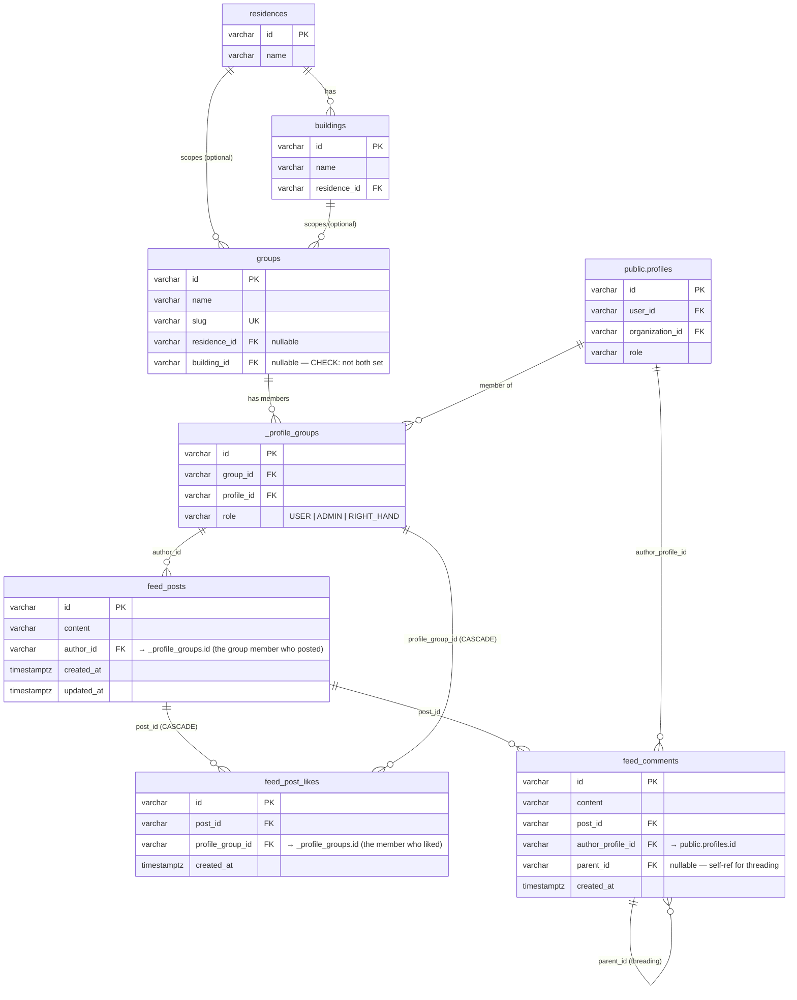

# Feed DB Model

```mermaid
erDiagram

    residences {
        varchar id PK
        varchar name
    }

    buildings {
        varchar id PK
        varchar name
        varchar residence_id FK
    }

    profiles["public.profiles"] {
        varchar id PK
        varchar user_id FK
        varchar organization_id FK
        varchar role
    }

    groups {
        varchar id PK
        varchar name
        varchar slug UK
        varchar residence_id FK "nullable"
        varchar building_id FK "nullable — CHECK: not both set"
    }

    profile_groups["_profile_groups"] {
        varchar id PK
        varchar group_id FK
        varchar profile_id FK
        varchar role "USER | ADMIN | RIGHT_HAND"
    }

    feed_posts {
        varchar id PK
        varchar content
        varchar author_id FK "→ _profile_groups.id (the group member who posted)"
        timestamptz created_at
        timestamptz updated_at
    }

    feed_post_likes {
        varchar id PK
        varchar post_id FK
        varchar profile_group_id FK "→ _profile_groups.id (the member who liked)"
        timestamptz created_at
    }

    feed_comments {
        varchar id PK
        varchar content
        varchar post_id FK
        varchar author_profile_id FK "→ public.profiles.id"
        varchar parent_id FK "nullable — self-ref for threading"
        timestamptz created_at
    }

    residences ||--o{ buildings : "has"
    residences ||--o{ groups : "scopes (optional)"
    buildings  ||--o{ groups : "scopes (optional)"

    groups         ||--o{ profile_groups  : "has members"
    profiles       ||--o{ profile_groups  : "member of"

    profile_groups ||--o{ feed_posts      : "author_id"
    feed_posts     ||--o{ feed_post_likes : "post_id (CASCADE)"
    profile_groups ||--o{ feed_post_likes : "profile_group_id (CASCADE)"
    feed_posts     ||--o{ feed_comments   : "post_id"
    profiles       ||--o{ feed_comments   : "author_profile_id"
    feed_comments  ||--o{ feed_comments   : "parent_id (threading)"
```

## Remaining open item

| Item | Detail |
|---|---|
| No API route | `apps/api/src/routes/feed.ts` does not exist yet |
